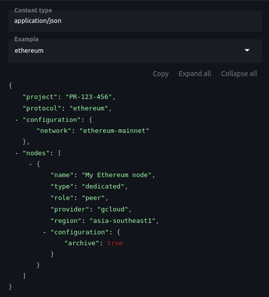
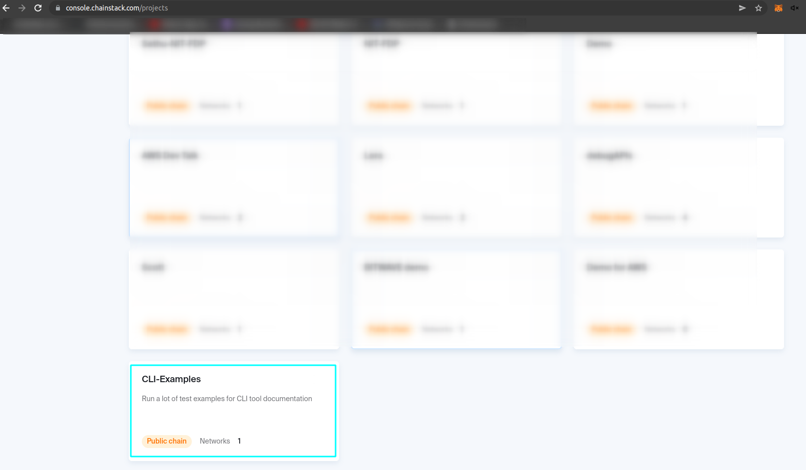

# Creating a new Ethereum network with an initial full node:

---

Lets say we want to create a new Ethereum network, initially with a full node. First, in the project's root folder, open a terminal and run:

```
node index
```

A new input will be prompted asking for your Chainstack's api key. You can get yours from [Chainstack console](https://console.chainstack.com/user/settings/api-keys).


After that, you can get to choose any of the requests specified in the [api reference documentation](https://docs.chainstack.com/api/reference/):


Select **Network Requests**, then **Create Network**.


If we check the documentation reference for [creating a network](https://docs.chainstack.com/api/reference/#operation/createNetwork), it requires a few parameters in JSON format. Paramaters differs on some networks, but for **EVM based** networks (like Ethereum) they are pretty much the same:



Now, you will be prompted to select all of this parameters as inputs to succesfully create a new ethereum network. First, a **project is needed**, since a project ID is required as param. Projects list will vary depending on the organization you are in, so be sure to **create a new project before creating networks**.


Then, you need to choose **which protocol** will be used for the network, in this example we'll use ethereum.


Next, we need to input a name. For evm based networks, it will set the network type as name by default.


After that, it's required to pass a list of initial nodes. In this example we will create just one full node, but you can try creating a few more if needed. First a name is required for the node:


Then, a provider and a region from the provider is required. Regions will vary depending on the provider you choose. Please refer to the [creating nodes reference](https://docs.chainstack.com/api/reference/#operation/createNode) for further details. In this case, we'll select aws from the provider list, and us-east-1 as region.


Now we need to choose the type of node to create. Currently, **only shared nodes are supported**.


Finally we need to set if the node will be in archive mode. In this example **we'll select NO**, as we are creating a full node.


We'll be asked if we want to add another node. In this example we will create just one for simplicity, but you can try adding more nodes if you wish:


And thats it! If everything goes well, you shall see this kind of output from the terminal.


Now if we go to the [Chainstack's console]() we can look for our network and it's initial full node.




